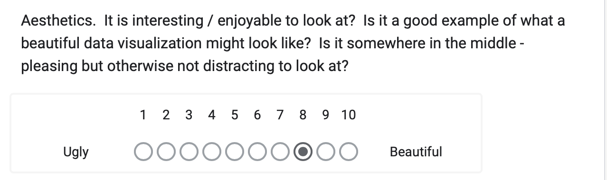

| [home page](https://danningwho.github.io/danning-hu-portfolio/) | [data viz examples](dataviz-examples) | [critique by design](critique-by-design) | [final project I](final-project-part-one) | [final project II](final-project-part-two) | [final project III](final-project-part-three) |

# Makeover Monday

## Visualization selection:
I selected the first graphic from: https://blackwealthdata.org/explore/business 

<noscript>

</noscript>
<object class='tableauViz'  style='display:none;'><param name='host_url' value='https%3A%2F%2Fpublic.tableau.com%2F' /> 
<param name='embed_code_version' value='3' /> <param name='site_root' value='' />
<param name='name' value='BWDC-BusinessOwnership-Section1_1&#47;Dashboard-BusinessOwnership-Section1_1' />
<param name='tabs' value='no' /><param name='toolbar' value='yes' />
<param name='static_image' value='https:&#47;&#47;public.tableau.com&#47;static&#47;images&#47;BW&#47;BWDC-BusinessOwnership-Section1_1&#47;Dashboard-BusinessOwnership-Section1_1&#47;1.png' /> 
<param name='animate_transition' value='yes' /><param name='display_static_image' value='yes' />
<param name='display_spinner' value='yes' /><param name='display_overlay' value='yes' />
<param name='display_count' value='yes' /><param name='language' value='en-US' />
<param name='origin' value='viz_share_link' /><param name='filter' value='padding=0' /><param name='filter' value='position=relative' />
</object>
                

## Step Two: Initial Feedback

  

  
**Describe your overall observations about the data visualization here.  What stood out to you?  What did you find worked really well?  What didn't?  What, if anything, would you do differently?**

* The title might be a little misleading in that the chart only shows the data for one race (as specified by the interactive panel.) I like the use of a histogram/bar chart to show a distribution of firm receipt accounts. However, I was not familiar what firm receipt amount but rather have a vague guess as to what it is. This could mean that the chart is not going to be accessible to the average person, but for someone who has knowledge in the area such as policy makers, relevant non-profits/business incubators, etc. If the intent of the chart is to show differences between race, I do not think the chart is doing a good job in making comparisons as you have to toggle between charts in order to see differences. If we are trying to show a comparison between groups, it may be useful to include data from other races in the graph.  

**Who is the primary audience for this tool?  Do you think this visualization is effective for reaching that audience?  Why or why not?**

* Given the context, I feel like the audience is for those in the public/private sector who are interested in the state of businesses (specifically, given the website's name, looking to see the state of black businesses). I think there can be more to be done to communicate the state of black businesses - drawing more attention to where they stand in comparison to others - would be very beneficial to see if there is more to be done or if the current state is healthy.

**Final thoughts: how successful what this method at evaluating the data visualization you selected? Are there measures you feel are missing or not being captured here?  What would you change?  Provide 1-2 recommendations (color, type of visualization, layout, etc.)**

* I think this method is great at ensuring you consider multiple metrics of a graph. For the visualization itself, I would recommend adding other demographic groups and highlighting the bars for black businesses to 1) increase impact of black businesses and 2) have a point of comparison.

## Step three: sketch a solution

## Step four: test the solution
| ID                | "Can you tell me what you think this is?"                                                                                   | "Can you describe to me what this is telling you?"                                                                                                          | "Is there anything you find surprising or confusing?"                                                                 | "Who do you think is the intended audience for this?"                                | "Is there anything you would change or do differently?"                                                              |
|-------------------|----------------------------------------------------------------------------------------------------------------------------|-------------------------------------------------------------------------------------------------------------------------------------------------------------|-----------------------------------------------------------------------------------------------------------------------|-------------------------------------------------------------------------------------|-----------------------------------------------------------------------------------------------------------------------|
| Student, MSPPM    | A chart showing firm receipt differences                                                                                   | That there are disparities for black firms                                                                                                                  | What constitutes a black firm? What is a firm receipt?                                                                | Probably for someone in the business space?                                       | Improve on the title and axis to be more descriptive                                                                   |
| Biochemist        | A chart comparing firms and how much they are worth separated by race/ethnicity                                           | There are significantly less black employer firms compared to white employer firms, and slightly less black employer firms compared to Asian and Hispanic firms | I don’t really know what a firm receipt is, but that’s a me problem                                                  | Investors, people who study other businesses/the economy                           | I don’t think so                                                                                                      |
| Investment Banker | This is a graph displaying the amount of receipts firms receive/collect split by receipt size and owner race              | This tells me that there are many more white-owned businesses that are spending large amounts of money at a time than that of other races                   | Yeah, I’m not sure what black employer firms or firm receipt amounts are                                             | The intended audience is people studying social sciences                           | I would make the title more clear as to what this is measuring                                                        |
| Product Designer  | To be honest, I’m not sure what I think this graph is because there’s a lot of different dimensions being shown, and the word “firm” might be used in multiple different contexts in the same graph | I think this graph is telling me that most firms have firm receipt amounts for white firms who have more than 1,000,000?                                     | The entire graph is confusing, sorry                                                                                  | I think the intended

# Analysis from interviews:
Looking at the uploaded image, here’s an analysis of the feedback, patterns, and suggested design changes:  

---

### **Similarities in Feedback**  
1. **Terminology Confusion**:
   - All participants expressed uncertainty or confusion about key terms like "firm," "firm receipt," or "black firm."  

2. **Title and Axis Issues**:
   - Three participants specifically noted that the title or axis needs to be more descriptive to help them understand what the chart is measuring.  

3. **Audience Insights**:
   - Most participants identified the intended audience as professionals or researchers in specific domains (e.g., social sciences, investors, financial analysts) but that wasn’t apparent from the start.

4. **Complexity**:
   - The chart's complexity made it difficult for some participants (especially the Product Designer) to follow.  

---

### **Differences in Feedback**  
1. **Understanding of the Data**:
   - The Student and Biochemist were able to identify disparities or patterns in the data, while the Product Designer found the entire chart confusing.  
   - The Investment Banker identified the main takeaway as "white-owned businesses having more receipts" but lacked deeper clarity.  

2. **Suggestions for Change**:
   - Some participants wanted simpler design elements (e.g., reducing dimensions), while others focused on making the chart more descriptive (titles, labels, etc.).  

---

### **Patterns in the Feedback**  
- **Clarity**: There is a consistent need for clearer terminology and better labeling.  
- **Target Audience**: While the chart might work for a professional audience, it is not immediately accessible to general readers.  
- **Design Complexity**: Multiple dimensions and unclear axes make the visualization overwhelming for some users.  

---

### **What I Learned from the Feedback**  
- Simpliciify: Overly complex charts can alienate audiences.  
- Precise language matters: Terms like "firm receipt" need explanation or rephrasing.  
- Unless it is very clear, understanding the audience can be a bit hard for a reader to get at the start.

---

### **Proposed Design Changes for Final Redesign**  
Add a legend or glossary explaining terms like "firm receipt" and "black firm."  

2. **Improve the Title and Labels**:  
   - Use a clear and specific title that reflects what the data measures.  
   - Label axes with explicit descriptions, e.g., “Total Firm Receipts ($)” instead of vague terms.  

3. **Reduce Complexity**:  
   - Use multiple smaller charts if necessary to compare different groups.  

Step five: build your solution	

  <noscript>
    
  </noscript>
  <object class='tableauViz'  style='display:none;'>
    <param name='host_url' value='https%3A%2F%2Fpublic.tableau.com%2F' /> <param name='embed_code_version' value='3' /> 
    <param name='site_root' value='' />
    <param name='name' value='MakeOverMonday_17394179765160&#47;Dashboard1' />
    <param name='tabs' value='no' /><param name='toolbar' value='yes' />
    <param name='static_image' value='https:&#47;&#47;public.tableau.com&#47;static&#47;images&#47;Ma&#47;MakeOverMonday_17394179765160&#47;Dashboard1&#47;1.png' /> 
    <param name='animate_transition' value='yes' />
    <param name='display_static_image' value='yes' />
    <param name='display_spinner' value='yes' />
    <param name='display_overlay' value='yes' />
    <param name='display_count' value='yes' />
    <param name='language' value='en-US' />
    <param name='filter' value='publish=yes' />
  </object>
            	
  
