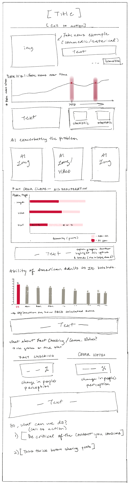

| [home page](https://danningwho.github.io/danning-hu-portfolio/) | [data viz examples](dataviz-examples) | [critique by design](critique-by-design) | [final project I](final-project-part-one) | [final project II](final-project-part-two) | [final project III](final-project-part-three) |

## Project Overview and Outline
### What is this project about?
The main spark of inspiration for this project started from a CMU course, the Media and American Politics. For one of the classes, I covered the reading notes on Fake News and the complexities of regulating social media platforms that both house and serve as a forum for both misinformation and disinformation to spread.  
The online social sphere is so broad, it can be hard to wrap our heads around the landscape of it. Furthermore, with AI (broadly speaking) growing in capabilities and usage, the applications for good and for ill-intent are still to be discovered or already being utilized. Misinformation tends to spike during periods of uncertainty, such as elections or natural disasters, and the rise of generative AI has exacerbated the issue by enabling rapid content creation in multiple mediums at scale. 

With this project, I aim to cover:
- The range of “misinformation” – some are genuinely benign while others can cause harm
- Amount of misinformation spiking in contentious or uncertain times → i.e. elections or natural disasters
- How AI has exacerbated the problem → ability to generate content faster than before and at scale
- What percentage of americans have shared misinformation? → wanting the reader to think about their own behavior
- Fact checking and community notes– while imperfect and generally show an slight positive influence in reducing misinformation, for the most part, people remain adhering to their worldview. (this may not have a visualization)
- “OK, so what now?” → call to action: you cannot rely on the information you receive at face value, especially around contentious topics, so always pause to think before sharing.

### In class exercise: 
q) Write a one sentence summary of your project
With generative AI’s growing capabilities, the spread of misinformation can be done at scale.

q) What do you want the reader to take away: as a reader, I want to _____ so that I can _____
I want to understand the misinformation landscape so that I can be better informed in the content I consume

q) what is my call to action? What do you want them to do
I will think twice before sharing potentially fake content

### Story Arc

## Initial Sketches

## Data
This data is from the OECD measuring the ability of adults to identify online disinformation generated by AI from around the globe. I will be using this to contextualize a (primarily) US based audience on their ability to spot disinformation compared to others.
- https://goingdigital.oecd.org/en/indicator/81 

There is some time series data and the proliferation of fake news sites. I want to use this data to showcase the spike during “contentious periods” such as elections. It is also useful to see the trends of fake news sites as well.
- Allcott, Hunt; Gentzkow, Matthew; Yu, Chuan, 2023, "Replication Data for: Trends in the Diffusion of Misinformation on Social Media", https://doi.org/10.7910/DVN/YAR9FU, Harvard Dataverse, V1, UNF:6:kqgEgg58izRh9Y5BOzAykg== [fileUNF]
Replication Data for: Trends in the Diffusion of Misinformation on Social Media
- https://dataverse.harvard.edu/dataset.xhtml?persistentId=doi:10.7910/DVN/YAR9FU
- Specifically the fake news sites data over time: https://dataverse.harvard.edu/file.xhtml?fileId=3391734&version=1.0&toolType=PREVIEW 

This is the AMMeBa (Annotated Misinformation, Media-Based) Dataset created by Google and Duke containing over 140,000 fact checked urls. I plan to use this dataset to show the proliferation of AI in misinformation and to add more information to the landscape.
- https://www.kaggle.com/datasets/googleai/in-the-wild-misinformation-media 

## Method and medium
I plan to use Shorthand and Tableau (and excel if needed) to complete my project. Shorthand will be the hosting platform and I will use Tableau for all data visualizations.

## In-class critique
What worked?
- The topic itself seems to be interesting/can hook people in
- The datasets found support the story well

What didn’t work
- May want to narrow down and refine the story a bit more
- What questions came up
- “What is your story structure?”

What new inspiration arose
- Correlating to time periods will be very important

## References
Adam, D. (n.d.). Does Fact-Checking Work? Here’s What the Science Says. Scientific American. Retrieved February 2, 2025, from https://www.scientificamerican.com/article/does-fact-checking-work-on-social-media/
AMMeBa: A Large-Scale Survey and Dataset of Media-Based Misinformation In-The-Wild. (n.d.). Retrieved February 2, 2025, from https://arxiv.org/html/2405.11697v1

Chuai, Y., Tian, H., Pröllochs, N., & Lenzini, G. (2024). Did the Roll-Out of Community Notes Reduce Engagement With Misinformation on X/Twitter? Proc. ACM Hum.-Comput. Interact., 8(CSCW2), 428:1-428:52. https://doi.org/10.1145/3686967
Fake news shared on social media U.S. (n.d.). Statista. Retrieved February 2, 2025, from https://www.statista.com/statistics/657111/fake-news-sharing-online/

Goldstein, J. A., Chao, J., Grossman, S., Stamos, A., & Tomz, M. (2024). How persuasive is AI-generated propaganda? PNAS Nexus, 3(2), pgae034. https://doi.org/10.1093/pnasnexus/pgae034

OECD. (2024). The OECD Truth Quest Survey: Methodology and findings.

OECD Going Digital Toolkit. (n.d.). Ability of adults to identify online disinformation created by generative AI [Dataset]. https://www.oecd.org/going-digital-toolkit

Pearson, J. (2024, May 28). Google research shows the fast rise of AI-generated misinformation. CBC News. https://www.cbc.ca/news/science/artificial-intelligence-misinformation-google-1.7217275

Tomz, M. (2024). How Persuasive is AI-Generated Propaganda? [Dataset]. Harvard Dataverse. https://doi.org/10.7910/DVN/LAZ7AA

## AI acknowledgements
No AI was used for this assignment.
